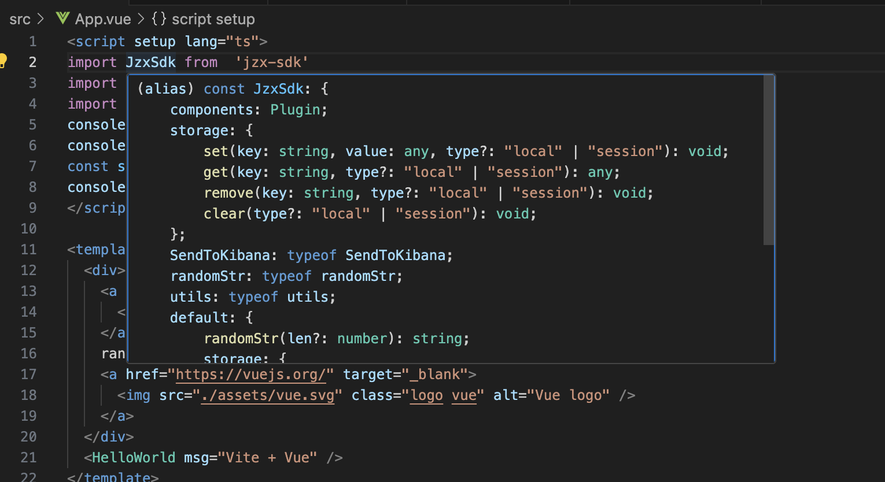
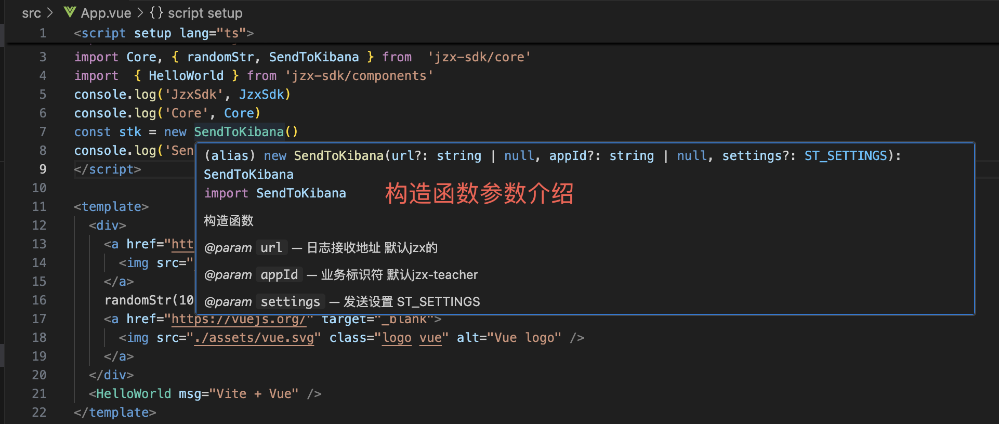
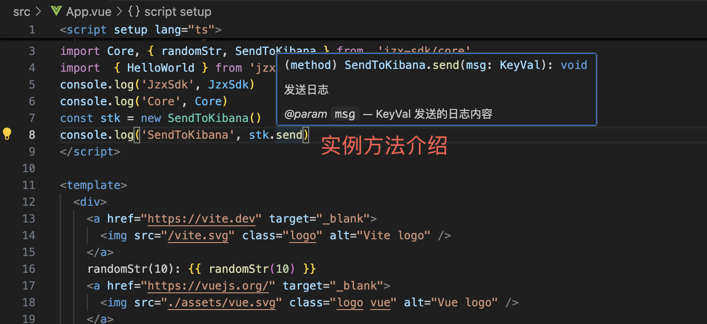

## sdk构建
```javascript
yarn build
```
## 项目引用sdk
#### 安装依赖
```javascript
yarn add @aixuexi/jzx-sdk
```
#### 项目引用（demo）
```javascript
// 全量引用
import JzxSdk from 'jzx-sdk'

// 只全量引用js相关
import JzxCore from 'jzx-sdk/core'
// 只引用js某个方法（按需加载）
import { randomStr } from  'jzx-sdk/core'

// 只全量引用vue组件相关 main.ts
import components from 'jzx-sdk/components'
createApp(App).use(components).mount('#app')

// 只引用某个vue组件 任何组件script中（按需加载）
import { HelloWorld } from 'jzx-sdk/components'
// template引用组件
<HelloWorld msg="Vite + Vue" />
```
#### 功能注释
鼠标悬浮引用对象，可弹出对象的属性、方法等介绍


